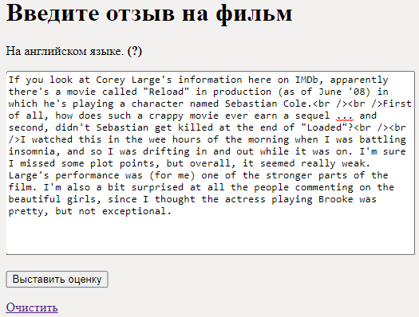
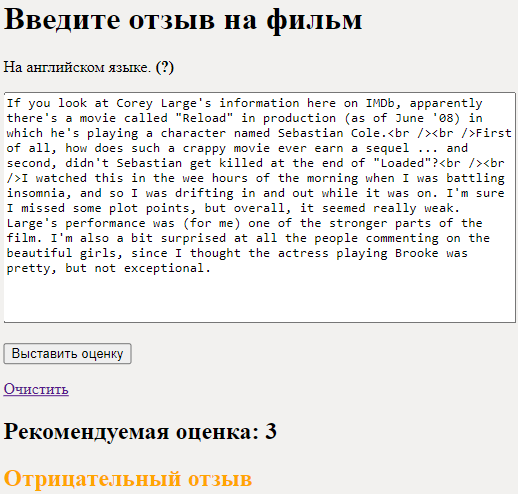
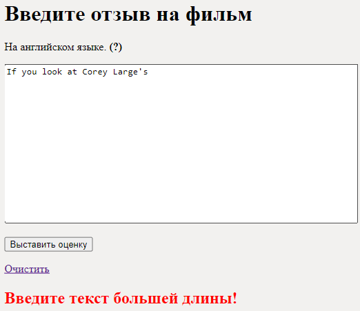

# Оценка рецензий на фильмы

***[Веб-приложение](http://90.188.95.219:8000/)***

***[Обученная модель fastText](https://drive.google.com/file/d/1KnIPPfSdsg_EAJERlQGWA3pRW7vKgGSS/view?usp=sharing)***

## Оглавление

1.	[Набор данных](#набор-данных)
2.	[Обучение нейронных сетей](#обучение-нейронных-сетей)
3.	[Веб-приложение](#веб-приложение)

## Набор данных

Для обучение НС был использован набор данных [aclImdb](https://github.com/gizenmtl/IMDB-Sentiment-Analysis-and-Text-Classification/tree/master/aclImdb).

Набор данных содержит 50 тыс. размеченных отзывов на фильмы. Отзывы на английском языке.

Также в наборе данных отсутствуют отзывы с оценкой 5 и 6, так как возникает проблема отнесения данных отзывов в одну из двух категорий.

## Обучение нейронных сетей

Было выбрано пять моделей НС:

1.	[Bert Base](https://arxiv.org/abs/1810.04805v2);
2.	[Bert Large](https://arxiv.org/abs/1810.04805v2);
3.	[fastText](https://arxiv.org/abs/1607.01759);
4.	[TextCNN](https://www.aclweb.org/anthology/D14-1181/);
5.	[TextRNN](https://www.ijcai.org/Proceedings/16/Papers/408.pdf).

Результаты обучения моделей НС:

|Модель|Бинарная классификация|Многоклассовая классификация|
|:----:|:---------------------:|:-------------------------:|
|Bert Base|89.67%|41.16%|
|Bert Large|90.28%|42.74%|
|fastText|**90.38%**|**45.6%**|
|TextCNN|87.51%|41.63%|
|TextRNN|86.63%|41.95%|

В разработанном веб-сервисе использовалась модель fastText, так как имеет самую большую точность (45.6%).

[Исходный код](https://github.com/bingjo/FilmReviews/tree/main/Neural%20network%20models).

Для обучения и тестирования моделей НС использовались [библиотеки python](https://github.com/bingjo/FilmReviews/blob/main/Neural%20network%20models/requirements.txt).

## Веб-приложение

Приложение создано на базе фреймворка Django.

На сайте присутствует поля для ввода текста и отправки текста для обработки.

После ввода текста и его отправки на сервер, будет выведена предсказанная оценка и комментарий (положительная рецензия или отрицательная).

Если оценка ниже или равна 4, то рецензия отрицательная. Если оценка больше или равна 7, то положительная.

Если длина текста меньше 30 символов или текст не введен вовсе, будет выдано предупреждение.

